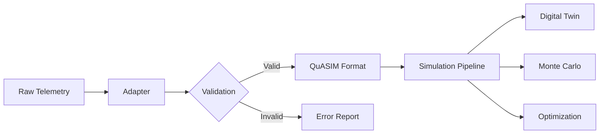

# Vehicle Models and Telemetry Adapters

## Overview

QuASIM provides telemetry adapters for multiple space vehicle models, enabling real-time ingestion, validation, and simulation of spacecraft trajectories and GNC (Guidance, Navigation, and Control) scenarios. These adapters integrate with QuASIM's quantum-accelerated simulation pipeline to support mission planning, digital twin modeling, and scenario analysis.

## Supported Vehicle Models

### 1. SpaceX Falcon 9

**Module:** `telemetry_api.spacex_adapter`

**Capabilities:**
- Ascent trajectory data ingestion
- Engine telemetry (thrust, ISP, throttle)
- Attitude control (quaternion, angular rates)
- GNC feedback control loop data

**Schema Fields:**
- `timestamp`: Mission elapsed time (seconds)
- `vehicle_id`: Vehicle identifier (e.g., "Falcon9_B1067")
- `ascent_data`: Altitude, velocity, downrange distance
- `engine_data`: Merlin engine performance metrics
- `attitude_data`: Vehicle orientation and angular rates
- `gnc_loops`: Guidance mode and control gains

**Example Usage:**
```python
from telemetry_api import SpaceXTelemetryAdapter

adapter = SpaceXTelemetryAdapter(endpoint="localhost:8001")
adapter.connect()

raw_data = {
    "timestamp": 120.5,
    "vehicle_id": "Falcon9_B1067",
    "altitude": 50000.0,
    "velocity": 2500.0,
    "thrust": 7500.0,
    "throttle": 100.0,
}

telemetry = adapter.parse_telemetry(raw_data)
is_valid, errors = adapter.validate_schema(telemetry)

if is_valid:
    print("Telemetry validated successfully")
```

### 2. NASA Orion/SLS

**Module:** `telemetry_api.nasa_adapter`

**Capabilities:**
- Orion spacecraft state vector tracking
- SLS launch vehicle telemetry
- GNC operational mode monitoring
- Control system and sensor data

**Schema Fields:**
- `met`: Mission Elapsed Time (seconds)
- `vehicle_system`: "Orion", "SLS", or "Orion_ESM"
- `state_vector`: Position and velocity [x, y, z, vx, vy, vz]
- `gnc_mode`: GNC operational mode (NOMINAL, SAFE, ABORT, DOCKING, REENTRY)
- `control_data`: Thruster commands and reaction wheel torques
- `sensor_data`: Star tracker, IMU, and GPS measurements

**Example Usage:**
```python
from telemetry_api import NASATelemetryAdapter

adapter = NASATelemetryAdapter(log_format="NASA_CSV_V2")

# Parse CSV log
csv_line = "100.0,Orion,6700000,0,0,0,7500,0,NOMINAL"
telemetry = adapter.parse_csv_log(csv_line)

# Export to QuASIM format
quasim_data = adapter.export_quasim_format(telemetry)
```

### 3. Dragon Spacecraft

**Module:** `telemetry_api.dragon_adapter`

**Capabilities:**
- Orbital trajectory tracking (position, velocity, acceleration)
- Thermal control system monitoring
- Power system telemetry (solar arrays, battery SOC)
- GNC data with docking support
- Proximity operations and docking scenarios

**Schema Fields:**
- `timestamp`: Mission elapsed time (seconds)
- `vehicle_id`: Vehicle identifier (e.g., "Dragon_C210")
- `trajectory_data`: Position, velocity, acceleration in ECI frame
- `thermal_data`: Radiator, cabin, and battery temperatures
- `power_data`: Solar array voltage, battery state of charge
- `gnc_data`: Attitude quaternion, angular velocity, control mode
- `docking_data`: Docking status, relative range, alignment errors

**Mission Profiles:**
- Low Earth Orbit (LEO) operations
- ISS rendezvous and docking
- Free-flight operations
- Deorbit and splashdown

**Example Usage:**
```python
from telemetry_api import DragonTelemetryAdapter

adapter = DragonTelemetryAdapter(endpoint="localhost:8002")
adapter.connect()

raw_data = {
    "timestamp": 250.0,
    "vehicle_id": "Dragon_C210",
    "position": [6700000.0, 0.0, 0.0],
    "velocity": [0.0, 7500.0, 0.0],
    "altitude": 400000.0,
    "orbital_phase": "LEO",
    "attitude_q": [0.7071, 0.7071, 0.0, 0.0],
    "cabin_temp": 22.0,
    "battery_soc": 98.0,
    "docking_status": "APPROACH",
    "rel_range": 100.0,
}

telemetry = adapter.parse_telemetry(raw_data)
is_valid, errors = adapter.validate_schema(telemetry)

# Export for QuASIM simulation
quasim_data = adapter.export_quasim_format(telemetry)
```

### 4. Starship Vehicle

**Module:** `telemetry_api.starship_adapter`

**Capabilities:**
- Full vehicle dynamics (forces, moments, mass properties)
- Multi-stage support (Booster and Ship)
- Raptor engine telemetry (up to 33 engines on Booster, 6 on Ship)
- Advanced GNC scenarios (ascent, coast, reentry, landing)
- Atmospheric flight data (Mach number, angle of attack)
- Reentry and landing system monitoring

**Schema Fields:**
- `timestamp`: Mission elapsed time (seconds)
- `vehicle_id`: Vehicle identifier (e.g., "Starship_S25")
- `stage_id`: "Booster" or "Ship"
- `dynamics_data`: Position, velocity, acceleration, attitude, angular rates, mass properties
- `propulsion_data`: Raptor engine thrust, throttle, gimbal, propellant mass
- `gnc_data`: Flight mode, guidance target, navigation solution, control gains
- `atmosphere_data`: Altitude, dynamic pressure, Mach number, angle of attack
- `reentry_data`: Heat flux, stagnation temperature, grid fin deflection, landing leg status

**Flight Modes:**
- PRELAUNCH: Pre-launch hold and countdown
- ASCENT: Powered ascent with Raptor engines
- COAST: Unpowered coast phase
- REENTRY: Atmospheric reentry with belly-flop maneuver
- DESCENT: Powered descent for landing
- LANDING: Final landing phase with leg deployment
- ABORT: Abort scenario

**Example Usage:**
```python
from telemetry_api import StarshipTelemetryAdapter

adapter = StarshipTelemetryAdapter(endpoint="localhost:8003")
adapter.connect()

# Booster ascent telemetry
booster_data = {
    "timestamp": 150.0,
    "vehicle_id": "Starship_S25",
    "stage_id": "Booster",
    "position": [0.0, 0.0, 50000.0],
    "velocity": [100.0, 0.0, 500.0],
    "mass": 300000.0,
    "raptor_count": 33,
    "raptor_thrust": [2000.0] * 33,
    "flight_mode": "ASCENT",
    "altitude": 50000.0,
    "mach": 2.5,
}

telemetry = adapter.parse_telemetry(booster_data)
is_valid, errors = adapter.validate_schema(telemetry)

# Ship reentry telemetry
ship_data = {
    "timestamp": 500.0,
    "vehicle_id": "Starship_S25",
    "stage_id": "Ship",
    "position": [100000.0, 0.0, 60000.0],
    "velocity": [500.0, 0.0, -200.0],
    "mass": 200000.0,
    "flight_mode": "REENTRY",
    "altitude": 60000.0,
    "mach": 10.0,
    "aoa": 60.0,
    "reentry_mode": "BELLY_FLOP",
    "heat_flux": 500.0,
}

telemetry = adapter.parse_telemetry(ship_data)
quasim_data = adapter.export_quasim_format(telemetry)
```

## Architecture

### Telemetry Ingestion Pipeline



### Data Flow

1. **Ingestion**: Raw telemetry data from gRPC/JSON-RPC endpoints or log files
2. **Parsing**: Adapter-specific schema parsing and field extraction
3. **Validation**: Schema compliance checks and range validation
4. **Export**: Conversion to QuASIM internal format for simulation
5. **Simulation**: Integration with quantum-accelerated simulation pipeline

## Validation

All adapters implement comprehensive validation:

- **Timestamp validation**: Non-negative mission elapsed time
- **Vehicle ID validation**: Format compliance checks
- **State vector validation**: Position and velocity range checks
- **Attitude validation**: Quaternion normalization
- **Physical constraints**: Mass, thrust, temperature, pressure ranges
- **Mission phase validation**: Valid mode transitions

## Testing

Comprehensive test suites are provided for all vehicle models:

```bash
# Run all telemetry adapter tests
pytest tests/integration/test_dragon_adapter.py -v
pytest tests/integration/test_starship_adapter.py -v

# Run specific test
pytest tests/integration/test_dragon_adapter.py::TestDragonTelemetryAdapter::test_parse_full_telemetry -v
```

**Test Coverage:**
- Dragon adapter: 17 comprehensive tests
- Starship adapter: 21 comprehensive tests
- SpaceX Falcon 9 adapter: Covered by existing integration tests
- NASA Orion/SLS adapter: Covered by existing integration tests

## Integration with QuASIM

Vehicle telemetry adapters integrate seamlessly with QuASIM's digital twin and optimization capabilities:

### Digital Twin Modeling

```python
from telemetry_api import DragonTelemetryAdapter
from quasim.dtwin import DigitalTwin

adapter = DragonTelemetryAdapter()
twin = DigitalTwin(vehicle_type="Dragon")

# Ingest telemetry stream
for raw_data in telemetry_stream:
    telemetry = adapter.parse_telemetry(raw_data)
    quasim_data = adapter.export_quasim_format(telemetry)
    twin.update_state(quasim_data)
    twin.predict_trajectory(horizon=60)
```

### Mission Planning and Optimization

```python
from telemetry_api import StarshipTelemetryAdapter
from quasim.opt import MissionOptimizer

adapter = StarshipTelemetryAdapter()
optimizer = MissionOptimizer(vehicle="Starship", stage="Ship")

# Optimize reentry trajectory
telemetry = adapter.parse_telemetry(reentry_data)
optimal_trajectory = optimizer.optimize_reentry(
    initial_state=telemetry,
    constraints=["max_heat_flux", "landing_accuracy"],
    objective="minimize_fuel"
)
```

## Future Enhancements

Planned additions to vehicle model library:

- **Crew Dragon**: Enhanced life support and crew monitoring
- **Starlink Satellite**: Constellation management and orbit maintenance
- **Europa Clipper**: Deep space mission profiles
- **Artemis Lander**: Lunar descent and surface operations
- **Mars Sample Return**: Multi-vehicle coordination

## References

- [SpaceX Falcon User's Guide](https://www.spacex.com/vehicles/falcon-9/)
- [NASA Orion Quick Facts](https://www.nasa.gov/orion)
- [Dragon Cargo User's Guide](https://www.spacex.com/vehicles/dragon/)
- [Starship User's Guide](https://www.spacex.com/vehicles/starship/)

## API Reference

For detailed API documentation, see:
- `telemetry_api.dragon_adapter.DragonTelemetryAdapter`
- `telemetry_api.starship_adapter.StarshipTelemetryAdapter`
- `telemetry_api.spacex_adapter.SpaceXTelemetryAdapter`
- `telemetry_api.nasa_adapter.NASATelemetryAdapter`
